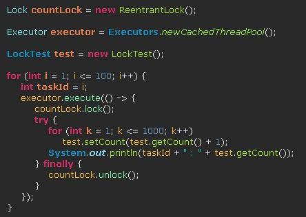
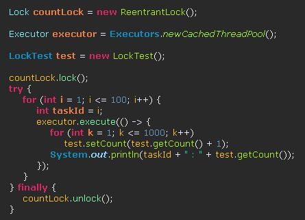

## 병행 프로그래밍

### Thread(스레드)

- task : 처리하는 작업의 단위
- 스레드는 1개 이상의 task를 묶어 실행할 수 있다.
- 간단한 task의 경우 하나의 스레드에서 모두 처리하는 것이 효율적이다.(스레드를 실행하는데 발생하는 비용을 줄이는 것이 좋다.)
- 강도 높은 계산을 하는 task의 경우는 스레드와 task를 1:1로 만들고, 하나의 프로세서에서 하나의 스레드만 실행되도록 하는 것이 효율적이다.(프로세서 안에서 스레드 간의 context switching하는데 발생하는 오버헤드를 줄일 수 있다.)
- 멀티 스레딩에서의 context switching은 같은 process내에서만 이루어진다.

		Runnable hellos = () -> {
			for(int i = 1; i <= 1000; i++) {
				System.out.println("Hello " + i);
			}
		};
		
		Runnable goodbyes = () -> {
			for(int i = 1; i <= 1000; i++) {
				System.out.println("goodbye " + i);
			}
		};
		
		Executor executor = Executors.newCachedThreadPool();
		
		executor.execute(hellos);
		executor.execute(goodbyes);
		
		// Executor executor = Executors.newFixedThreadPool(5);
		
		int processors = Runtime.getRuntime().availableProcessors(); // 현재 시스템의 프로세서의 개수

출력

Hello 1~1000
goodbye 1~100

무작위로 실행된다.(여러개의 스레드가 실행 순서를 보장하지 않고 실행된다.)

프로그램이 마지막 출력 후 바로 종료되지 않는다.(프로그램은 스레드 pool에서 나온 스레드가 잠시 유휴(idle, 가동되지 않는) 상태에 있어서 Executor가 종료시킬 때 종료된다.)

---
	Executors.newCachedThreadPool()

- 프로그램에 최적화 되어있는 ExecutorService 인스턴스를 리턴한다.
- 프로그램에는 대부분의 시간을 대기하면서 보내는 task가 다수 포함되어 있다.
- 대기중인 유휴 스레드(idle thread)에서 실행되지만, 모든 스레드가 실행 중이면 새로운 스레드가 할당된다.
- 장시간 동안 유휴 상태인 스레드는 종료된다.

---

	Executor executor = Executors.newFixedThreadPool(numThread);

- 고정된 개수의 스레드 풀을 가지는 ExecutorService 인스턴스를 리턴한다.
- 고정된 개수만큼의 모든 스레드가 실행중일 때 실행해야할 task가 있으면 대기하다 종료되는 스레드가 있을 때 실행된다.

---

### Future / ExecutorService

- sub task
	- 하나의 task를 완료하기 위한 결과물을 만들어내는 task 안의 세분화 된 task.
	- Callable 인터페이스의 call 메소드를 구현해 만들 수 있다.
	- 여러 개의 Callable인터페이스를 구현한 클래스의 인스턴스를 List에 넣어 하나의 task로 묶을 수 있다.
	- 병행으로 실행된다.
	- 실행 순서를 보장하지 않는다.
	- sub task들이 모두 완료될 때 까지 해당 task에서 block된다.

			public interface Callable<V> {
				V call() throws Exception;
			}

---

#### Future

- 하나의 task를 여러 개의 sub task로 나눌 때 각각의 sub task의 결과 값을 담는 인스턴스
- task는 이미 submit 또는 invokeAll/Any에서 실행됐다.

- 메소드들

	- V	get() : sub task가 완료된 결과 값을 리턴한다.
	- V	get(long timeout, TimeUnit unit) : 실행이 완료되어 결과 값을 리턴하거나 타임아웃에 이를 때까지 블록한다. 
	- boolean	cancel(boolean mayInterruptIfRunning) : task 취소를 시도한다.
	- boolean	isCancelled() : cancel을 통한 취소여부를 리턴한다.(취소 되었으면 true)
	- boolean	isDone() : task가 결과 값을 리턴하고 정상적으로 완료되었는지 여부를 리턴한다.(정상적으로 종료되었으면 true)

---

#### ExecutorService
- Executors.newCachedThreadPool/Executors.newCachedThreadPool가 리턴하는 인스턴스
- sub task들을 future 인스턴스로 변환해 실행할 수 있도록 해준다.

	ExecuteService executor = Executors.newCachedThreadPool();
	Callable<V> task = ...;
	Future<V> result = executor.submit(task); // 하나의 sub task를 Future 인스턴스로 만들어 준다. 

---

	String[] words = { "abcde", "hahaoho", "pop", "ppp" };

	List<Callable<Long>> tasks = new ArrayList<>(); // sub task를 묶을 List 생성

	for (String word : words) {
		tasks.add(() -> { // Callable 인터페이스를 구현한 익명 클래스를 tasks에 추가한다.
			long pCount = 0;
			for (int wordI = 0; wordI < word.length(); wordI++) {
				if (word.charAt(wordI) == 'p')
					pCount++;
			}
			return pCount;
		});
	}

	List<Callable<Long>> otherTasks = new ArrayList<>();
	
	for (String word : words) {
		otherTasks.add(() -> {
			System.out.println("otherTask");
			long pCount = 0;
			for (int wordI = 0; wordI < word.length(); wordI++) {
				if (word.charAt(wordI) == 'p')
					pCount++;
			}
			System.out.println("pCount : " + pCount);
			return pCount;
		});
	}

	ExecutorService executor = Executors.newCachedThreadPool(); // ExecutorService인스턴스 생성(Executor 아님)

	List<Future<Long>> results = executor.invokeAll(tasks); // submit을 사용하지 않고 List로 한 번에 넣을 경우 사용(여기서 sub task가 실행된다.)
	List<Future<Long>> otherResults = executor.invokeAll(otherTasks); // 바로 위의 task가 완료되기 전까지 block된다.

	long total = 0;

	for (Future<Long> result : results)
		total += result.get(); // sub task들로부터 결과 값을 리턴 받아 tatal에 추가한다.
	
	System.out.println("total : " + total);

	}

출력(첫 번째 시도)

	task
	task
	pCount : 0
	task
	task
	pCount : 2
	pCount : 3
	pCount : 0
	otherTask
	pCount : 0
	otherTask
	otherTask
	pCount : 2
	pCount : 0
	otherTask
	pCount : 3
	total : 10

출력(두 번째 시도)

	task
	task
	task
	task
	pCount : 3
	pCount : 2
	pCount : 0
	pCount : 0
	otherTask
	otherTask
	otherTask
	otherTask
	pCount : 0
	pCount : 3
	pCount : 2
	pCount : 0
	total : 10

- 출력으로 확인할 수 있는 부분

	- 하나의 task가 전부 끝나기 전까지 blocking된다.(1~1000까지 출력하는 task를 2개 실행해도 blocking되어 task1~1000, otherTask1~1000이 순서대로 출력된다.)
	- task안의 sub task가 병행으로 실행되고 실행순서가 보장되지 않는다.
	- Future는 task가 모두 실행되야 결과 값을 가져오기 때문에 get()은 항상 submit/invoke 이후에 실행된다.

---

#### sub task들이 완료될 때까지 호출한 task를 block하고 싶지 않을 때

- ExecutorCompletionService를 사용하면 된다.

		String[] words = { "abcde", "hahaoho", "pop", "ppp" };
	
		List<Callable<Integer>> tasks = new ArrayList<>();
		tasks.add(() -> {
			for (int i = 1; i < 1000; i++) {
				System.out.println("task : " + i);
			}
			return  0;
		});
	
		List<Callable<Integer>> otherTasks = new ArrayList<>();
	
		otherTasks.add(() -> {
			for (int i = 1; i < 1000; i++) {
				System.out.println("otherTask : " + i);
			}
			return  0;
		});
	
		ExecutorService executor = Executors.newCachedThreadPool();
	
		ExecutorCompletionService<Integer> service = new ExecutorCompletionService<>(executor);
	
		for (Callable<Integer> task : tasks)
			service.submit(task);
	
		for (Callable<Integer> task : otherTasks)
			service.submit(task);

출력

task1~1000, otherTask1~1000이 섞여서 나온다.(실행할 때마다 섞이는 개수가 다르다.)

---

#### invokeAny

- sub task 중 하나가 예외를 던지지 않고 완료하면 Future의 값을 리턴하고 다른 sub task를 취소한다.
- 일치하는 대상을 발견한 즉시 결론을 내릴 수 있는 검색에서 유용하다.

	String word = ...;
	Set<Path> files = ....;
	List<Callable<Path>> tasks = new ArrayList<>();
	for(Path p : files) tasks.add(
		()->{if(p에 단어가 있으면) return p;
			else
				throw Exception;	
			}
	)

	Path found = executor.invokeAny(tasks); // sub task들이 실행되고 return이 될 경우 다른 sub task를 종료시킨다.

return하지 않는 경우에 예외를 던져버리면 된다.

---

### 스레드 안정성

#### Visibility(가시성)

- 스레드에서 변경된 데이터가 다른 스레드에서 정상적으로 읽히는 성질
- 멀티 스레딩에서 쓰이는 데이터는 가시성을 보장해야 한다.

		private static boolean done;
	
		public static void main(String[] args) {
	
			Runnable hellos = () -> {
				for (int i = 1; i <= 1000; i++) 
					System.out.println("Hello : " + i);
				
				done = true;
				System.out.println("done was changed");
			};
	
			Runnable goodbye = () -> {
				int i = 1;
				while (!done) 
					i++;
				System.out.println("goodbye : " + i);
			};
	
			Executor executor = Executors.newCachedThreadPool();
	
			executor.execute(hellos);
			executor.execute(goodbye);
	
		}

출력

	Hello : 1
	Hello : 2
	...
	Hello : 1000
	done was changed

프로그램이 끝나지 않는다.

---

hellos의

	done = true;

가 실행되지만 goodbyte task에는 적용되지 않는다. 즉 가시성이 없다.

실행되지 않는 이유로는 캐싱(cashing)과 명령어 재배치(instruction reordering)가 있다.

- 캐싱
	- 데이터를 캐시 메모리 / 레지스터와 같이 빠르게 접근할 수 있는 메모리에 일시적으로 저장하는 것.
	
	- CPU의 core들은 각각 메인 메모리와 별도로 캐시 메모리, 레지스터를 가지고 있다.
	
	- 목적 : 메모리에 옮겨 놓고 다시 접근할 때 기존 저장장치(ex) 하드디스크)에 접근하는 것보다 빠르게 접근할 수 있도록 하는 것
	
	- 위의 코드에서 캐싱이 원인이 되는 이유 
		- 공유 자원(done)에 두 개의 스레드가 접근하게 되는데 각각의 스레드에서 접근하는 캐시 메모리가 있고 하나의 스레드(hellos)에서 변경된 자원의 값이 다른 스레드(goodbye)의 캐시메모리에 적용되지 않아서 생기는 문제

- 명령어 재배치

	x = y와 관련없는 값;
	y = x와 관련없는 값;
	z = x+y;

z는 x와 y의 연산이 완료된 이후에 실행되야 하지만, x,y끼리는 연산되는 순서가 달라도 상관없다. 프로세서는 두 단계를 병렬로 수행하거나, 순서를 바꿀 수 있다.

---

#### visibility를 보장하는 경우

- final 변수의 값은 초기화 이후
- static 변수의 초깃값은 정적 초기화 후
- volatile 변수의 변경
- lock을 해제하기 전에 일어나는 변경은 lock을 획득하는 쪽에서 보장된다.

위의 코드에서는

	private static volatile boolean done;

으로 선언해주면 가시성이 보장된다.

- volatile : 변수를 메인 메모리에 저장한다.(공유하는 변수라도 각각의 스레드에 있는 캐시메모리가 아닌 하나만 존재하는 메인메모리에서 읽기/쓰기가 이루어지기 때문에 가시성이 보장된다.)
	- 하지만 자원을 경쟁하는 경우에는 가시성을 보장하지 못할 수도 있다.

- 초기화 이후에 변하지 않는 필드는 final로 선언해주면 가시성이 보장된다.

---

### 경쟁 조건

- 공유되는 자원(위의 코드에서 done)에 여러 개의 스레드가 동시에 접근해 변경(경쟁)하면 연산이 정확하지 않을 수 있다.

	private static volatile int count = 0; // 공유자원
	
	public static void main(String[] args) {
		
		Executor executor = Executors.newCachedThreadPool();
		
		for(int i = 1; i <= 1000; i++) {
			int taskId = i;
			Runnable task = () -> {
				for(int k = 1; k <= 1000; k++) {
					count++; // 여러 개의 스레드가 변수 count에 동시에 접근해 값을 변경한다. 
				}
				System.out.println(taskId + " : " + count);
			};
			executor.execute(task);
			
		}

	}

출력

	1 : 2000
	4 : 4318
	5 : 4318
	3 : 3000
	2 : 2000
	...
	306 : 935459
	304 : 935459
	308 : 935459
	310 : 935459

- 공유 자원(count)을 여러 스레드가 동시에 접근할 때(task 306~310번) 처음에 같은 값으로 접근하면 종료할 때 count 값은 동일하게 증가된다.

- 이전 예제에서는 valotile 변수(done)에 두 개의 스레드가 접근하지만 하나의 스레드에서만 값이 변경되고 나머지에서는 값을 읽기만 하기 때문에 문제가 없었던 것이다.

- task의 번호는 큰 의미가 없다. 1000개의 task가 실행되고 최종으로 count의 값이 1000000이면 되는 것이다.

---

### 안전한 병행을 위한 전략

#### confinement(가두기)

- 공유자원에 접근하는 경우에는 사용하지 않는 것이 좋다.

- 종류
	- Ad-Hoc Thread Confinement
		- valotile 변수를 병행으로 실행되는 여러 Thread중에서 하나의 Thread에서만 수정하도록 개발자가 직접 관리하는 것(위의 예제중에 done을 사용한 것)
		- 대부분의 경우에 쓰이지 않는다.

	- Stack Confinement
		- task(메소드)의 stack영역에 공유 자원을 가두는 방법.
		
				private long numberOfPeopleNamedJohn(List<Person> people) {
					  List<Person> localPeople = new ArrayList<>();
					  localPeople.addAll(people);
					  return localPeople.stream().filter(person -> person.getFirstName().equals("John")).count();
				}

		- 공유자원인 people list를 받아서 task(thread)안에서 local로 만든 localPeople에 deep copy를 한다.
		
		- localPeople은 현재 thread내에서만 실행되는 자료구조이기 때문에 수정을 해도 공유자원에 영향을 주지 않는다.

		- 주의사항
			- deep copy한 local 자원을 해당 thread의 스코프 내에서만 사용해야한다.

	- Thread Local
		- 다음에 알아보자(참고사이트 : https://dzone.com/articles/java-concurrency-thread-confinement)

---

#### immutability(불변성)

- 불변 클래스의 인스턴스 공유하는 것(뒤에서 불변 클래스 설명)
- 대표적인 불변 클래스 : String, 기본형 변수의 래퍼 클래스들
- 참조하는 변수가 없어지면 Garbarge Collector의 삭제 대상이 된다.

---

#### locking(잠금)

- 공유자원에 여러 개의 Thread가 접근하려고 할 때 하나의 Thread만 접근할 수 있도록 제한하는 것

- 접근해야하는 다른 Thread는 대기해야 하므로 병행프로그래밍의 효율을 많이 떨어뜨릴 수 있다.

---

### 불변 클래스

- 한 번 인스턴스를 생성하고 나서 변경할 수 없는 클래스

- 불변 클래스의 인스턴스를 공유 자원으로 접근할 때 가시성을 보장할 수 있다.(필드의 변경이 안되니까)

- 조건

	- 인스턴스 변수(필드, 기본형/래퍼클래스/다른 불변클래스의 인스턴스)를 모두 final로 선언해야 한다.(Collection의 자료구조의 경우 final로 선언해도 add/remove등의 메소드로 내부 element의 수정이 가능하기 때문에 race condition이 발생할 수 있다.)
	
	- 클래스 내의 어떤 메소드도 setter메소드가 되면 안된다.
	
	- 메소드 또는 class를 final로 선언해서 상속받은 클래스에서 메소드를 오버라이딩해 필드를 수정하는 일이 없도록 해야 한다.
	
	- 인스턴스 변수를 가변 상태로 유출(파라미터로 전달)하면 안된다. 사본을 리턴하거나 파라미터로 전달해야한다.
	
	- 생성자에서 this 참조를 노출하지 않아야 한다.

---

### 병렬 알고리즘

- java에서는 병렬 알고리즘으로 연산을 하는 메소드를 제공한다.

#### Parallel Stream(병렬 스트림)

	List<String> coll = new ArrayList<>();
	
	coll.add("ABCD");
	coll.add("EFGH");
	coll.add("ABCD");
	coll.add("ABCD");
	coll.add("EFGH");
	
	long result = coll.parallelStream().filter(s->s.startsWith("A")).count();

---

#### 병렬 배열연산

- Arrays클래스는 병렬 연산하는 메소드를 제공한다.

##### Arrays.parallelSetAll(array, IntUnaryOperator 인터페이스)

	int[] values = new int[15];
	
	Arrays.parallelSetAll(values, i -> i % 10);
	
	for(int valuesI = 0; valuesI < values.length; valuesI++) {
		System.out.print(values[valuesI] + " ");
	}

출력

	0 1 2 3 4 5 6 7 8 9 0 1 2 3 4 

콜백함수에 사용되는 IntUnaryOperator는 배열의 크기만큼 (0~length-1) 전부 리턴되는 값을 초기화한다.

---

##### Arrays.parallelSort(array, fromIndex, toIndex)

- 해당 인덱스 범위만 정렬한다.

		for(int valuesI = 0; valuesI < values.length; valuesI++) {
			System.out.print(values[valuesI] + " ");
		}

		Arrays.parallelSort(values, values.length / 2, values.length);
		System.out.println();

		for(int valuesI = 0; valuesI < values.length; valuesI++) {
			System.out.print(values[valuesI] + " ");
		}

출력

	0 1 2 3 4 5 6 7 8 9 0 1 2 3 4 
	0 1 2 3 4 5 6 0 1 2 3 4 7 8 9 

---

		String[] words = {"abc","abcd", "a", "ab"};
		
		Arrays.parallelSort(words, Comparator.comparing(String::length)); // 길이를 기준으로 natural order로 정렬한다.
		
		for(int wordsI = 0; wordsI < words.length; wordsI++) {
			System.out.print(words[wordsI] + " ");
		}

출력

	a ab abc abcd 

---

##### 병렬로 배열에 대한 연산을 할 때

- 해당 배열의 타입에 맞는 stream을 생성 -> 병렬스트림으로 변환 -> 연산

		long sum = IntStream.of(values).parallel().sum();
		
		System.out.println(sum);

출력

	55

---

### thread safty 자료구조

#### ConcurrentHashMap

- 동시에 해당 맵의 연산을 수행할 때 많은 스레드가 동시에 연산을 해도 map에 손상을 입히지 않는다.

		ConcurrentMap<String, Long> map = new ConcurrentHashMap<>();
		
		map.compute("word", (key,value) -> value == null ? 1 : v+1);
		
		System.out.println(map.get("word"));
		
		map.computeIfPresent("123",  (key,value) -> Long.parseLong(key) + value);
		map.computeIfAbsent("123",  (key) -> Long.parseLong(key) + 1L);
		
		map.putIfAbsent("word", 1L);
		
		System.out.println(map.get("123"));
		
		map.merge("word", 1L, (existingValue, newValue) -> existingValue + newValue);
		
		map.merge("word", 1L, Long::sum);

- compute, computeIfPresent, computeIfAbsent, merge 메소드는 원자적이다.(thread safe하다. 해당 map을 업데이트 중일 때에는 다른 스레드에서 map에 접근할 수 없다.)
- compute, computeIfPresent, merge 메소드의 마지막 파라미터는 BiFunction 인터페이스의 apply 추상메소드를 구현한 것이다.
- computeIfAbsent의 마지막 파라미터는 Function 인터페이스의 apply 추상메소드를 구현한 것이다.
---

##### compute(key, 연산(BiFunction인터페이스의 apply메소드))

	map.compute("word", (key,value) -> value == null ? 1 : value+1);

에서 내부적으로 map.get(k)를 실행한다. 

key값이 없다면 null일 것이고, null을 get의 파라미터로 넣으면 NullPointException이 발생하기 때문에 value가 null인 조건으로 key값이 있는지 확인하는 것이다.(그렇기 때문에 value값이 null인 key를 넣으면 안된다.)

---

##### computeifPresent(key, key가 있을 때 할 연산(BiFunction인터페이스의 apply메소드))

	map.computeIfPresent("123",  (key,value) -> Long.parseLong(key) + value);'

map에 key값이 있을 때 연산을 실행한다.

---

##### computeIfAbsent(key, key가 없을 때 할 연산(Function인터페이스의 apply메소드))

	map.computeIfAbsent("123",  (key) -> Long.parseLong(key) + 1L);

map에 key값이 없을 때 연산을 실행한다. key가 없기 때문에 value도 없고 연산은 key값만을 가지고 할 수 밖에 없으므로 파라미터로 key값만 들어간다.

---

##### merge(key, key가 없을 때 default value값, 있으면 기존 value값과 두 번째 파라미터의 값으로 연산을 한다.) 

	map.merge("word", 1L, (existingValue, newValue) -> existingValue + newValue);
	
	map.merge("word", 1L, Long::sum);

- 두 코드는 같은 기능을 한다.

---

#### blocking queue

- queue의 최대 사이즈만큼 element가 들어가 있을 때 enqueue하려고 하면 blocking

- queue가 비어있을 때 dequeue하려고 하면 blocking

- 두개의 스레드에서 enqueue와 dequeue를 각각 병행으로 수행(생산자/소비자 task)할 때 상황에 따라 blocking을 수행한다.

- put : enqueue를 수행(꽉 차있으면 blocking)

- take : dequeue를 수행(비어있으면 blocking)

- 기존 queue에 있는 메소드들도 있지만 blocking queue를 쓰는 의미를 만들기 위해서는 위의 두 메소드를 써야한다.

- 종류 : LinkedBlockingQueue(LinkedList 기반), ArrayBlockQueue(circular array(원형 배열)기반)

---

	BlockingQueue<Integer> queue = new LinkedBlockingQueue<>(10); // queue의 element 최대 개수를 10개로 지정
	
	Runnable enqueueTask = () ->{
		
		for(int i = 1; i <= 100 ; i++) {
			try {
				System.out.println("enqueue : " + i);
				queue.put(i);
			} catch (InterruptedException e) {
				e.printStackTrace();
			}
		}
	};
	Runnable dequeueTask = () ->{
		
		for(int i = 1; i <= 100 ; i++) {
			try {
				System.out.println("dequeue : " + queue.take());
			} catch (InterruptedException e) {
				e.printStackTrace();
			}
		}
	};
	
	Executor executor = Executors.newCachedThreadPool();
	
	executor.execute(enqueueTask);
	executor.execute(dequeueTask); 

출력

	enqueue : 1
	enqueue : 2
	enqueue : 3
	dequeue : 1
	...
	dequeue : 98
	dequeue : 99
	dequeue : 100

enqueue / dequeue되는 순서는 매번 다르지만 enqueue / dequeue 각각 100번 씩 Exception을 띄우지 않고 정상적으로 실행된다.

---

소비자(dequeue) task는 큐가 비어있어도 종료되지 않는다.(아직 enqueue가 덜 되었을 수도 있기 때문에)

그렇기 때문에 소비자 task를 종료시키기 위해서는 마지막 enqueue하는 element에 마지막임을 알리는 값을 추가해줘야 한다. 

---

	BlockingQueue<Integer> queue = new LinkedBlockingQueue<>(10);

대신

	Queue<Integer> queue = new LinkedList<>();

를 쓰고 put대신 add, take대신 poll을 사용할 경우

	enqueue : 1
	dequeue : null
	dequeue : null
	dequeue : null
	...
	enqueue : 98
	enqueue : 99
	enqueue : 100

와 같이 출력 된다.

queue가 비어있을 때 blocking되지 않고 null값을 리턴한다.

poll을 100번 실행하기는 하지만 enqueue 되어있지 않아도 실행되기 때문에 1~100까지 dequeue가 되지 않는다.

---

#### ConcurrentSkipListMap / ConcurrentSkipListSet

- TreeMap / TreeSet의 thread safe한 버전이다.

		ConcurrentMap<String, Integer> map = new ConcurrentSkipListMap<>(Collections.reverseOrder());
		
		map.putIfAbsent("1", 1);
		map.putIfAbsent("3", 1);
		map.putIfAbsent("4", 1);
		map.putIfAbsent("2", 1);
		map.putIfAbsent("5", 1);
		
		Iterator<String> keyIter = map.keySet().iterator();
		
		while(keyIter.hasNext()) {
			System.out.println(keyIter.next());
		}

출력

	5
	4
	3
	2
	1

---

#### CopyOnWriteArrayList / CopyOnWriteArraySet

- thread safe collection이다.

- 내부에 있는 모든 변경자는 하부 배열의 사본을 만든다.

- collection을 순회하는 스레드가 변경하는 스레드보다 많을 경우에 유용하다.

---

#### thread safe set

- ConcurrentHashSet은 없다.

- ConcurrentHashMap.newKeySet()을 사용하면 된다.
	- 실제로는 ConcurrentHashMap<K, Boolean>을 감싸는 래퍼 Set<K>를 리턴한다.(모든 value 값은 Boolean.TRUE다. key만 사용하기 때문에 신경안써도 된다.)

			Set<String> words = ConcurrentHashMap.newKeySet();

---

#### keySet에서 element의 변경

- keySet으로 만들어진 set view에서 element를 지우면 keySet을 만든 source map의 key값도 지워진다.

		Map<String, Integer> hashMap = new HashMap<>();
		
		Set<String> concurrentSet = concurrentMap.keySet();
	
		hashMap.put("1", 1);
		hashMap.put("2", 2);
		hashMap.put("3", 3);
	
		Set<String> hashSet = hashMap.keySet();
		
		hashSet.remove("2");
		
		int finededValue = hashMap.getOrDefault("2", 0);
		
		System.out.println(finededValue);

출력

	0

---

책에서는 

	Set<String> hashSet = hashMap.keySet(default value);

를 설정하면 

	hashSet.add("key");

를 했을 때 value값으로 default value가 추가된다고 하는데 파라미터를 받는 keySet이 ConcurrentHashMap에는 있는데 실행이 안되네?? 왜 안되지(HashMap에는 없다.)

---

### Atomic Value(원잣값)

- 스레드에서 공유자원의 원잣값을 가지고 연산을 하게되면 다른 스레드에서 자원에 접근해도 경쟁없이 연산이 가능하다.

- 원잣값을 연산하는 클래스를 자바에서 제공한다.

		AtomicLong nextNumber = new AtomicLong(); // 생성자에 초기값 설정가능(default value : 0)
		
		System.out.println(nextNumber.get()); // 인스턴스의 값을 가져온다.
		
		System.out.println(nextNumber.incrementAndGet());
		
		long compared = 1000;
		
		nextNumber.set(Math.max(nextNumber.get(), compared));
		
		nextNumber.updateAndGet(x->Math.max(x, compared)); 

---

	nextNumber.incrementAndGet()

값 1증가 -> 값 읽기 의 두 개의 연산을 원자적으로 처리한다. 그렇기 때문에 thread safe하다.

---

set(설정할 값)

	nextNumber.set(Math.max(nextNumber.get(), compared));

set과 get메소드는 각각 원자적이지만 두개의 메소드를 사용했기 때문에 전체 과정이 원자적이지 않다.

nextNumber의 값을 다른 thread에서 바꿔서 원하지 않는 값이 넘어올 수도 있다.

---

updteAndGet(LongUnaryOperator)

	nextNumber.updateAndGet(x->Math.max(x, compared));

set과 get메소드를 하나의 메소드로 처리한다. 원자적으로 처리되기 때문에 thread safe하다.

---

accumulateAndGet(비교할 대상, LongBinaryOperator)

	nextNumber.accumulateAndGet(compared, Math::max);

updateAndGet과 같은 동작을 한다.(두 개의 파라미터를 받는 것만 다르다.)

---

위의 메소드는 연산 -> 읽기를 실행한다.

getAndUpdate, getAndAccumulate 메소드는 읽기 -> 연산을 수행해 연산되기 전의 값을 읽어온다.(thread safe)

---

#### LongAdder

- counter의 배열(Cell[] cells)을 가지고 thread별로 하나의 인덱스에 값을 업데이트 할 수 있도록 한다.

- 각각의 thread는 해당 인덱스의 값만 업데이트하기 때문에 thread safe하다.

- 모든 thread의 연산이 끝난 이후에 합계 값을 구하는 경우에 사용하면 AtomicLong보다 훨씬 효율적이다.

		LongAdder count = new LongAdder();
		
		
		Runnable adder1 = () ->{
			count.add(5);
			count.increment();
		};
		
		Runnable adder2 = () ->{
			count.increment();
		};
		
		Runnable adder3 = () ->{
			count.add(3);
			count.increment();
		};
		
		Runnable sleeper = () -> {
			try {
				Thread.sleep(3000);
				System.out.println(count.sum());
			} catch (InterruptedException e) {
				e.printStackTrace();
			}
			
		};
		
		Executor executor = Executors.newCachedThreadPool();
		
		executor.execute(adder1);
		executor.execute(adder2);
		executor.execute(adder3);
		executor.execute(sleeper);

출력

	11

---

### LongAccumulator

- 생성자에 수행할 연산과 초기 값을 입력한다.
- accumulate메소드를 호출하면 파라미터로 작성한 값에 생성자에 작성한 연산을 수행한다.
- LongAdder와 같은 방식으로 돌아가지만 연산방식을 정할 수 있다는 장점이 있다.

		LongAccumulator accumulator = new LongAccumulator(Long::max, 8);
		
		Runnable adder1 = () ->{
			accumulator.accumulate(3);
		};
		
		Runnable adder2 = () ->{
			accumulator.accumulate(10);
		};
		
		Runnable adder3 = () ->{
			accumulator.accumulate(5);
		};
		
		Runnable sleeper = () -> {
			try {
				Thread.sleep(3000);
				System.out.println(accumulator.get());
			} catch (InterruptedException e) {
				e.printStackTrace();
			}
			
		};
		
		Executor executor = Executors.newCachedThreadPool();
		
		executor.execute(adder1);
		executor.execute(adder2);
		executor.execute(adder3);
		executor.execute(sleeper);

출력

	10	

---

double값을 다루는 DoubleAdder, DoubleAccumulator도 있다.

---

### 재 진입 가능 잠금

- Critical Session(임계영역) : 인터럽션 없이 온전히 하나의 스레드가 실행되어야 하는 영역

- Lock을 활용해 명시적으로 임계영역을 설정할 수 있다.

lock_correct

---

lock_incorrect

- 헷갈린 이유

	- incorrect도 비효율 적이긴 하지만 공유자원인 count를 영역안에 두었기 때문에 문제 없을 것이라고 생각

- 해결 방법
	
	- 임계영역은 "Thread"안에서 공유 자원을 사용할 떄 생기는 것이다. 그렇기 때문에 각각의 Thread 내부에서 lock과 unlock을 하는 것이 맞다.

- finally를 사용한 이유
	- 임계영역의 실행이 정상적으로 종료되든 Exception이 발생해서 종료되든 lock은 풀려야 하기 때문에
	- 그래야 공유자원에 접근하는 다른 thread들이 실행될 수 있다.(lock이 영구적으로 걸려있는 것을 방지한다.)
	- 
---

lock_correct 출력

	1 : 1000
	2 : 2000
	3 : 3000
	12 : 4000
	...
	99 : 97000
	91 : 98000
	96 : 99000
	98 : 100000

---

lock_incorrect 출력

	1 : 1853
	2 : 1853
	4 : 3485
	3 : 2853
	...
	96 : 70228
	45 : 70228
	98 : 70228
	93 : 71228

- lock은 최후의 수단으로 사용해야한다. 공유 자원의 사용을 피하기 위해 thread safe한 ConcurrentHashMap이나 LongAdder같은 자료구조를 사용하는 것이 좋다.

---

### synchronized를 사용한 비명시적인 임계영역 설정

- intrinsicLock : 모든 객체가 가지고 있는 고유한 lock(= monitorLock / monitor)

- 객체가 고유하게 가지고있는 instrinsicLock 사용해 lock을 명시하지 않고 임계영역에 잠금을 할 수 있다.

- 메소드를 synchronized로 선언한 경우

		public synchronized void setCount(int count) {
			this.count = count;
		}

	위의 코드는 다음과 같다.

		pubilc void setCount(int count) {
			
			this.intrinsicLock.lock();
			try{
				this.count = count;
			} finally {
				this.intrinsicLock.unlock();
			}
		}

intrinsicLock은 실제로 있는 객체는 아니고 객체 별로 고유한 lock을 가지고 있음을 예시로 든 것이다.

	public class LockTest {
	
		private int count;
	
		public LockTest() {
			count = 0;
		}
	
		public synchronized void addCount() {
			for(int i = 1; i <= 1000; i++) {
				this.count++;
			}
		}
		
	
		public static void main(String[] args){
	
			Lock countLock = new ReentrantLock();
	
			Executor executor = Executors.newCachedThreadPool();
	
			LockTest test = new LockTest();
	
			for (int i = 1; i <= 100; i++) {
				int taskId = i;
				executor.execute(() -> {
					test.addCount();
						System.out.println(taskId + " : " + test.getCount());
				});
			}
		}

출력

	1 : 2000
	4 : 4000
	3 : 3000
	2 : 2000
	...
	96 : 95000
	100 : 99000
	98 : 97000
	93 : 100000

100000은 나오긴 하는데 왜 task1이랑 task2에서 같은 시기에 접근하는 걸까??(lock이 되었으면 안 걸렸을 텐데, 1/2말고도 같은 값을 가지는 task들이 있다.)

---

#### 조건 대기

- 특정 조건에서 thread가 실행을 멈추고 대기해야 할 경우가 생길 수 있다.

- wait()메소드를 사용하면된다.(Object 클래스의 메소드다.)

		public class MyQueue<E> {
		
			class Node {
				E value;
				Node next;
			}
		
			private Node head;
			private Node tail;
		
			public MyQueue() {
		
			}
		
			public synchronized void put(E element) {
		
				Node node = new Node();
				if (head == null)
					head = node;
				else
					tail.next = node; // 현재 tail의 next(다음 tail)에 node를 참조
				tail = node;
				tail.value = element;
				notifyAll();
			}
		
			public synchronized E take() throws InterruptedException {
				while (head == null)
					wait();
		
				E headElement = this.head.value;
				this.head = head.next;
				return headElement;
		
			}
		
			public static void main(String[] args) {
		
				MyQueue<Integer> queue = new MyQueue<>();
		
				Executor executor = Executors.newCachedThreadPool();
		
				executor.execute(() -> {
					for (int i = 1; i <= 1000; i++) {
						queue.put(i);
					}
				});
		
				executor.execute(() -> {
					for (int i = 1; i <= 1000; i++)
						try {
							System.out.println(queue.take());
						} catch (InterruptedException e) {
							e.printStackTrace();
						}
				});
		
			}
		}

출력

1~1000까지 100개의 element가 모두 출력된다.

---

#### wait

	while (head == null)
		wait();

큐가 비어있을 경우에 해당 thread는 element가 추가될 때까지 blocking되어 있어야 한다.

wait 메소드를 호출하면 thread는 해당 객체의 wait set(대기집합)에 들어가게 된다.

wait set에 들어가있는 thread는 notifyAll/notify 메소드를 호출해야만 나올 수 있다.(큐에 element가 생겼어도 notifyAll 호출 없이는 나오지 못한다.)

---

#### notifyAll

	public synchronized void put(E element) {
		...
		notifyAll();
	}

element를 추가하고 wait set에 있는 thread를 나오게 만드는 notifyAll메소드를 호출했다.

notifyAll 메소드는 wait set에서 꺼내주는 것 뿐이지 take메소드의 wait다음 부분을 실행 할 수있게 해주는 것이 아니다.

다시 큐가 비었는지 확인하고 wait set으로 다시 올지 wait 다음 코드를 실행할지 다시 결정하는 것이다.

---

#### notify

notify메소드도 있지만 이 메소드를 사용한다면 wait set에 있는 thread 중 하나만 활성화 시킨다.

이 thread가 다시 조건에 맞지 않아 blocking 될 수 있다. 이 때 다른 thread에서 notify를 다시 호출해주지 않으면

프로그램은 교착상태에 빠지게 된다.

---

### Thread 클래스

- Thread 대신 Executor를 사용하는 것이 더 좋지만(실행되는 스레드들을 관리해주니까) 직접 사용하는 방법도 알아두면 좋다.

		public static void main(String[] args) throws InterruptedException {
	
			
			Runnable task = () -> {
				for(int i = 1; i <= 100; i++) 
					System.out.println("task1 : " + i);
								
				for(int i = 200; i <= 300; i++) 
					System.out.println("task1 : " + i);
				
				
			};
			
			Runnable task2 = () -> {
				
				for(int i = 1; i <= 100; i++) 
					System.out.println("task2 : " + i);
				

				for(int i = 200; i <= 300; i++) 
					System.out.println("task2 : " + i);
				
				
			};
			
			Thread thread1 = new Thread(task);
			Thread thread2 = new Thread(task2);
			thread1.start();
			thread1.join(5000);
			thread2.start();

---

#### Thread.sleep(millis) 

	try {
		Thread.sleep(2000);
	} catch (InterruptedException e) {
		e.printStackTrace();
	}

2000밀리초(2초) 간 Thread의 실행을 멈추고 다른 Thread가 실행될 수 있도록한다.

---

#### thread.join(millis)

	thread1.start();
	thread1.join(5000);
	thread2.start();

해당 thread가 죽을 때(정상종료 또는 exception 던짐)까지 기다린다. 

파라미터의 시간만큼 해당 스레드만 실행되도록 보장한다. 

시간 전에 끝나면 다른 thread 병행 실행

시간 이후에는 다른 thread와 병행되어 실행된다.

---

- sleep과 wait는 모두 checked exception인 InterruptedException을 던진다.

---

### Thread Interruption

- Interruption의 정확한 정의는 없지만 대부분 "취소 요청"을 의미한다.

		Runnable task = () -> {
			
			for(int i = 1; i <= 1000; i++) {
				
				if(Thread.currentThread().isInterrupted()) return;
				System.out.println(i);
			}
			
		}; 

- task를 실행하는 Thread가 인터럽트되면 run 메소드가 종료된다.

---

#### sleep을 사용할 때 Interrunption

	Runnable task2 = () -> {

		try {
			for (int i = 1; i <= 1000; i++) {
				if (i == 500)
					Thread.sleep(10000);
				System.out.println(i);
			}
		} catch (InterruptedException e) {
			e.printStackTrace();
		}
	};

- sleep 도중에 인터럽트가 발생하면 InterruptedException을 던진다. 그럴 경우에 종료시키면 된다.

---

### ThreadLocal

- Thread별로 인스턴스를 만들어 공유자원에서 발생하는 문제를 해결할 수 있다.

	public static final NumberForamt currnecyFormat = NumberFormat.getCurrencyInstance();

여러 개의 스레드에서

	String amountDue = currencyFormat.format(total);

으로 currencyFormat의 format을 호출하면 인스턴스 내부의 자료구자가 손상 될 수 있다.

해결방법

	
	public static final ThreadLocal<NumberFormat> currencyFormat = 
		ThreadLocal.withInitial(()->NumberFormat.getCurrencyInstance());

	// 개별 thread 내의 코드

	String amountDue = test.currencyFormat.get().format(1000);

스레드 별로 해당 스레드용 인스턴스를 생성해 format메소드를 호출하면 공유자원 문제가 해결된다.

---

### 비동기 계산

#### CompletableFuture

- 너무 어렵다...

---

### 프로세스

#### 생성

	ProcessBuilder builder = new ProcessBuilder("cmd.exe");

cmd.exe 프로그램을 실행하는 processor를 생성한다.

---

	Process p = new ProcessBuilder("cmd.exe", "mkdir", "test")
		.directory(Paths.get("/").toFile())
		.start();

와 같이 호출할 수도 있다.
---

	OutputStream processIn = p.getOutputStream();
	
	InputStream processOut = p.getInputStream();
	
	InputStream processErr = p.getErrorStream();

JVM이 개발자 입장이라고 보면 된다.

process의 InputStream -> JVM의 OutputStream

process의 Output/ErrorStream -> JVM의 InputStream

---

#### stream의 일부만 상속받기

	builder.redirectOutput(ProcessBuilder.Redirect.INHERIT);
	builder.redirectInput(ProcessBuilder.Redirect.INHERIT);
	builder.redirectError(ProcessBuilder.Redirect.INHERIT);

를 호출하면 된다.

---

#### process의 환경변수 수정

		Map<String, String> env = builder.environment();
		
		env.put("LANG", "fr_FR");
		env.remove("JAVA_HOME");
		Process process = builder.start();

put("환경변수명", "환경변수 값") 을 파라미터로 넣어 메소드를 호출하면 된다.

---

#### process 실행

	Process p = new ProcessBuilder("cmd.exe")
		.directory(Paths.get("/").toFile())
		.start();

	try(Scanner in = new Scanner(p.getInputStream())) {
		while (in.hasNextLine())
			System.out.println(in.nextLine());
	}

출력

	Microsoft Windows [Version 10.0.18362.900]
	(c) 2019 Microsoft Corporation. All rights reserved.
	입력대기...

---

process stream용 버퍼 공간은 제한되어 있다. 입력을 지나치게 제공하면 안되고, 출력은 즉시 읽어야한다. 입출력이 많을 때는 별도의 thread에서 읽기/쓰기 하는 것이 좋다.

---

