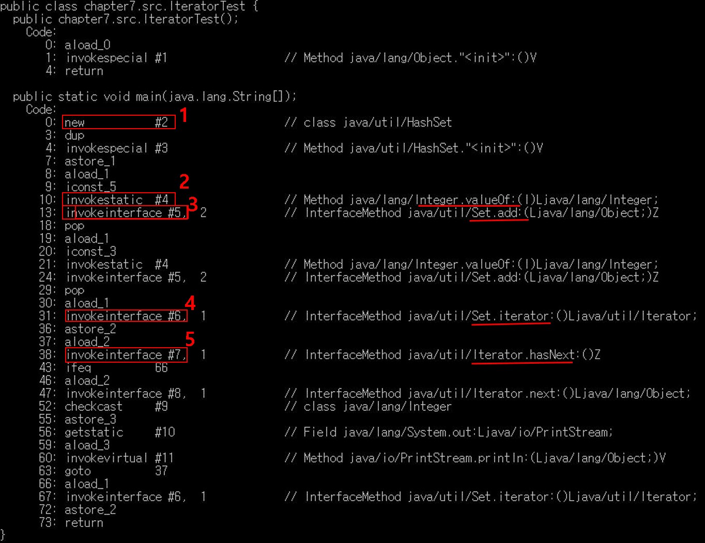

## 컬렉션 프레임워크(Collection Framwork)

- Set은 내부적으로 Map을 사용하고 있다.(HashSet은 HashMap, TreeSet은 TreeMap, LinkedHashSet은 LinkedHashMap 사용)

### Iterator(반복자)

- 특정 순서로 element를 순회한다.(set, map의 인덱스가 없으므로 정해진 순서가 없다.)

- forEach(향상된 for)문으로 set/list를 실행하면 내부적으로 iterator를 생성하고 iterator.next()메소드를 호출한다.(map은 key 또는 value로 구분해서 iterator를 호출해야 한다.)

	public class IteratorTest {
	
		public static void main(String[] args) {
			
			Set<Integer> set = new HashSet<>();
			
			set.add(5);
			set.add(3);
			
			for(Integer num : set) {
				System.out.println(num);
			}
			
			Iterator<Integer> iter = set.iterator();
			
	
		}
	
	}

1. HashSet 메소드 생성

2. element를 add하기 전에 Integer 타입으로 오토박싱

3. set.add메소드를 호출해 set에 추가

4. iterator 생성

5. hasNext메소드 호출

---

### Set(집합)

#### HashSet

- HashMap에서 key값만 사용한다.
	
HashMap 생성자

	   public HashSet() {
	        map = new HashMap<>();
	   }

- value는

	private static final Object PRESENT = new Object();

PRESENT 인스턴스로 채운다.(사용하지 않으니까 하나로 돌려막아도 상관없다.)

- 내부적으로 HashTable을 사용한다.

- Iterator메소드를 호출하면 HashMap.keyset.Iterator() 메소드를 호출한다.

    public Iterator<E> iterator() {
        return map.keySet().iterator();
    }

---

#### TreeSet

- TreeMap에서 key값만 사용한다.

- 정렬방식을 지정할 수 있고 iterator를 통해 값을 확인할 때 지정한 정렬 기준에 따라 key값을 확인할 수 있다.

- 정렬방식을 지정하는 방법

	- 생성자의 인자로 Comparable 인터페이스를 구현한 클래스를 전달한다.
	- 생성자의 인자로 Comparator 인터페이스를 전달한다.

##### Comparable vs Comparator

- Comparable : 구현한 클래스의 기본 정렬방식으로 사용된다
- Comparator : 기본 정렬방식 이외의 방식으로 정렬할 때 사용된다.

	int[] array = {1,2,3,4,5};
	Arrays.sort(array); 

Integer 클래스가 Comparable 인터페스를 구현했고, array를 Integer로 boxing하고 Integer 클래스의 CompareTo 메소드의 정렬방식으로 정렬을 한다.(바이트 코드에서는 박싱하는 코드를 찾아볼 수가 없네? 당연한건데) 

---

### Map

- key와 value의 쌍으로 데이터를 저장한다.

- key값은 유일한 값이어야 한다.(이미 있는 key값을 넣을 경우 가장 최근의 value로 저장된다.)

- Set은 Map에서 key만 사용하는 것이다.

- Set과 마찬가지로 key의 정렬 방식을 정하고 싶으면 TreeMap을 사용하면 된다.

- get 메소드는 key값이 없으면 null을 반환한다.

	map.getOrDefault(key, key가 없을 때 출력 값);

key 값이 없으면 설정한 값을 출력한다.(null값을 리턴하지 않도록 할 수 있다. if문에서 활용하기 좋을 듯. contains->get을 한 번에 처리 가능)

	map.merge(1, 1, Integer::sum);

값이 1인 key가 있으면 1을 증가시킨다.

	Integer.sum(int a, int b);

merge의 마지막 파라미터에 들어가는 메소드의 파라미터가 (oldValue, 두 번째 파라미터)이기 때문에 sum메소드의 호출이 가능한 것이다.(파라미터가 2개니까) 

---

#### forEach

	for(Entry<Integer,Integer> entry : map.entrySet()) {
		
		int key = entry.getKey();
		int value = entry.getValue();
		
		System.out.println("key : " + key);
		System.out.println("value : " + value);
		
		
	}

위의 코드를 forEach를 활용해 간단하게 만들 수 있다.

	map.forEach((k,v) ->{
		System.out.println("key : " + k);
		System.out.println("value : " + v);
	});
		
key,value를 동시에 가져올 때 forEach 메소드를 사용하면 Iterator인스턴스를 만들 필요가 없다.

---

#### HashMap

- key값을 정렬하지 않는 map

##### 구조

- HashMap에서만 사용되는 inner class인 Node(Map.Entry를 구현)가 있다.

node class

	    static class Node<K,V> implements Map.Entry<K,V> {
	        final int hash;
	        final K key;
	        V value;
	        Node<K,V> next;
	
	        Node(int hash, K key, V value, Node<K,V> next) {
	            this.hash = hash; // Object의 hashCode메소드를 활용해 만든다.
	            this.key = key;
	            this.value = value;
	            this.next = next; // 가장 뒤에 넣기 때문에 null이 된다.
	        }
	
	        public final K getKey()        { return key; }
	        public final V getValue()      { return value; }
	        public final String toString() { return key + "=" + value; }
	
	        public final int hashCode() {
	            return Objects.hashCode(key) ^ Objects.hashCode(value);
	        }
	
	        public final V setValue(V newValue) { // 중복된 key값을 넣었을 때 호출된다.(HashMap에선 사용되지 않음)
	            V oldValue = value;
	            value = newValue;
	            return oldValue;
	        }
	
	        public final boolean equals(Object o) {
	            if (o == this)
	                return true;
	            if (o instanceof Map.Entry) {
	                Map.Entry<?,?> e = (Map.Entry<?,?>)o;
	                if (Objects.equals(key, e.getKey()) &&
	                    Objects.equals(value, e.getValue()))
	                    return true;
	            }
	            return false;
	        }
	    }

---

노드 인스턴스를 생성하는 메소드

    Node<K,V> newNode(int hash, K key, V value, Node<K,V> next) {
        return new Node<>(hash, key, value, next);
    }

---

put 메소드를 내부에서 실행되는 메소드

	final V putVal(int hash, K key, V value, boolean onlyIfAbsent, boolean evict) {...}

- hash : key값을 사용해 hash값을 만들어 낸다.
- key/value : 입력받은 key/value값
- onlyIfAbsent : true일 경우 기존에 있던 key값에 put해도 value값을 교체하지 않는다.
- evict : false일 경우 table(put된 Node가 저장되어 있는 array) 생성모드가 된다.(뭔말인지 모르겠네)

---